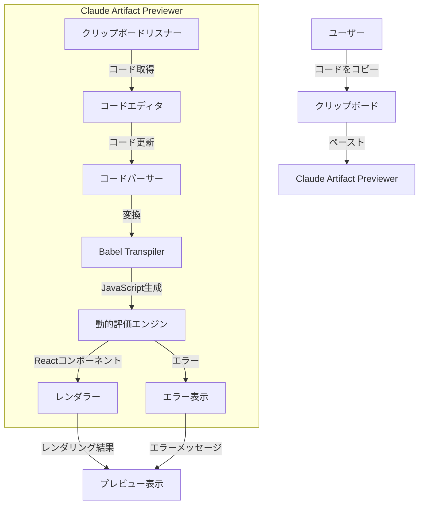
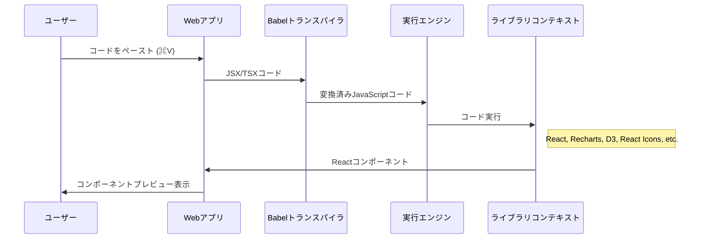
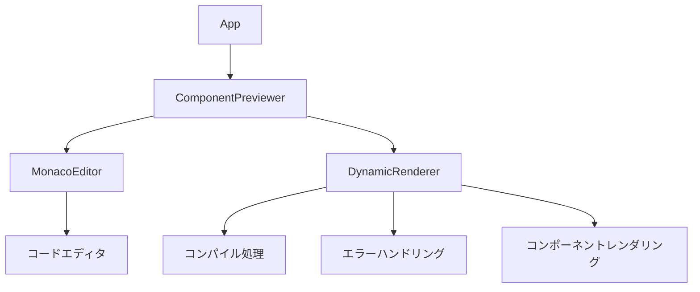
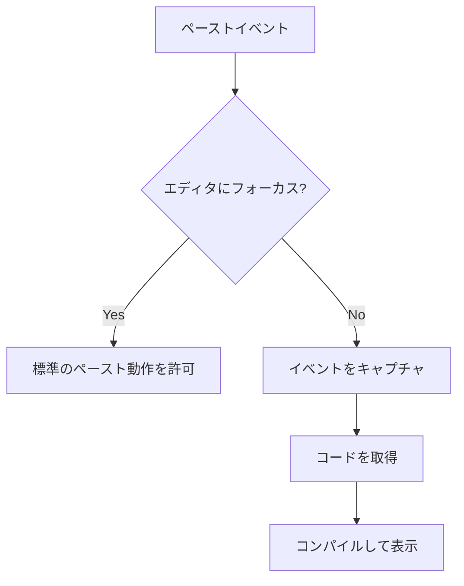

# Claude Artifact Previewer 設計ドキュメント

## 概要

Claude Artifact Previewerは、Claudeが生成したReactコンポーネントコードを即座にプレビューするためのWebアプリケーションです。ユーザーはClaudeから生成されたコードをコピーし、このアプリケーション上でペーストするだけで、コンポーネントを動的にレンダリングして確認できます。

## 主な機能

- クリップボードからコードを直接取得してレンダリング
- コードエディタでのリアルタイム編集と即時プレビュー
- 様々なライブラリ（Recharts, D3.js, React Iconsなど）のサポート
- エラー処理と表示

## アーキテクチャ

## 技術スタック

- **フロントエンド**: React + TypeScript
- **バックエンド**: Hono (Cloudflare Workers)
- **ビルドツール**: Vite
- **スタイリング**: Tailwind CSS
- **コードエディタ**: Monaco Editor
- **コード変換**: Babel Standalone

## データフロー

## コンポーネント構造

## 実装の詳細

### コア機能: コードの動的評価

クライアントサイドでReactコンポーネントコードを安全に実行するために、以下のアプローチを採用しています:

1. **Babel Standaloneによるトランスパイル**:
   - JSX/TSXコードをブラウザ内で標準的なJavaScriptに変換
   - React, TypeScriptのプリセットを使用
   - CommonJSモジュール形式に変換

2. **安全な実行環境**:
   - 必要なライブラリをグローバルコンテキストに提供
   - Function コンストラクタを利用した隔離された実行環境
   - エクスポートされたコンポーネントの検出と取得

3. **エラーハンドリング**:
   - コンパイルエラーと実行時エラーの捕捉
   - ユーザーフレンドリーなエラーメッセージの表示

### クリップボード統合

ページ全体でクリップボードイベントをリッスンしつつも、エディタ内のペースト操作には干渉しないよう設計:

## 提供ライブラリ

アプリケーションは以下のライブラリを事前に読み込み、Claudeが生成したコンポーネントで利用できるようにしています:

1. **データ可視化**:
   - Recharts: Reactベースのチャートライブラリ
   - D3.js: 強力なデータ可視化ツール
   - Chart.js: キャンバスベースのチャート作成
   - Plotly.js: インタラクティブな科学的グラフィックス

2. **UI要素**:
   - React Icons: 様々なアイコンセット

3. **ユーティリティ**:
   - Mathjs: 数学計算ライブラリ
   - Lodash: 便利なJavaScript関数集

4. **マルチメディア**:
   - Tone.js: Web Audioフレームワーク
   - Three.js: 3Dグラフィックス

5. **データ処理**:
   - Papaparse: CSV解析ライブラリ

## 課題と今後の改善点

現状では以下の課題があり、今後改善が必要です:

1. **CommonJSモジュール解決**: 
   - 現在、ES ModulesとCommonJSの混在によりモジュール解決に問題が発生することがある
   - 「exports is not defined」などのエラーが発生

2. **ライブラリの互換性**:
   - 一部のライブラリがブラウザ環境で完全に機能しない可能性がある
   - Polyfillの追加が必要かもしれない

3. **改善案**:
   - Module Federationの活用でよりクリーンなモジュール統合
   - 実行コンテキストの完全な隔離（Web Workers, iframeなど）
   - コード保存機能の追加
   - ライブラリのオンデマンドロード

## 使用方法

1. 開発サーバーを起動: `pnpm run dev`
2. ブラウザでアプリケーションにアクセス (http://localhost:3000)
3. Claudeが生成したReactコンポーネントコードをコピー
4. アプリケーション上で⌘V (Ctrl+V) を押してペースト
5. コンポーネントがプレビュー画面に表示される
6. 必要に応じてコードエディタで編集を行い、リアルタイムに変更を確認
